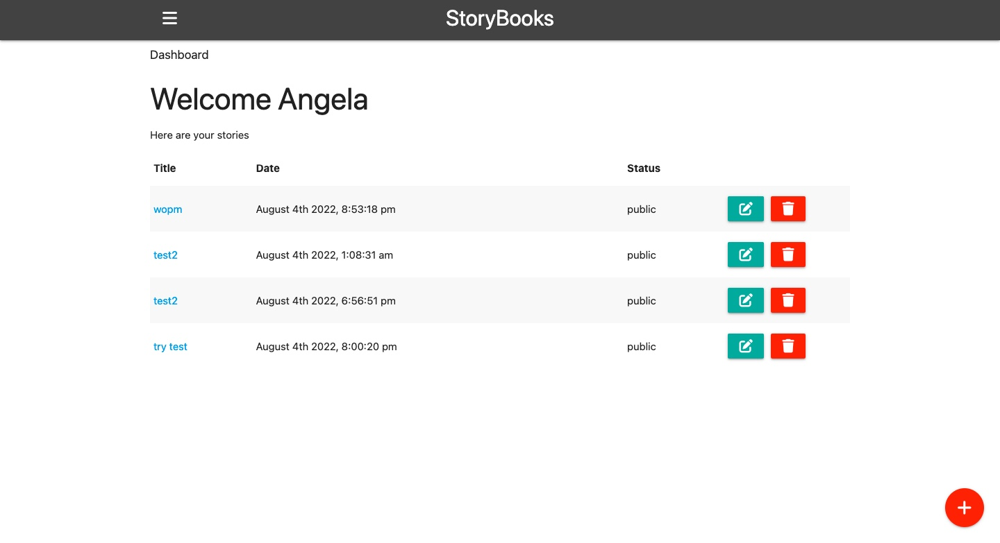
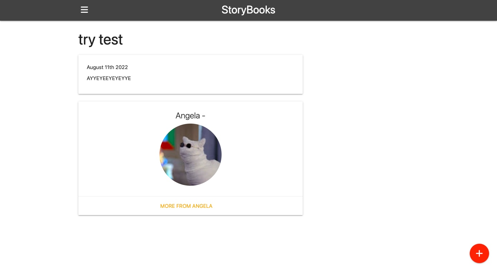
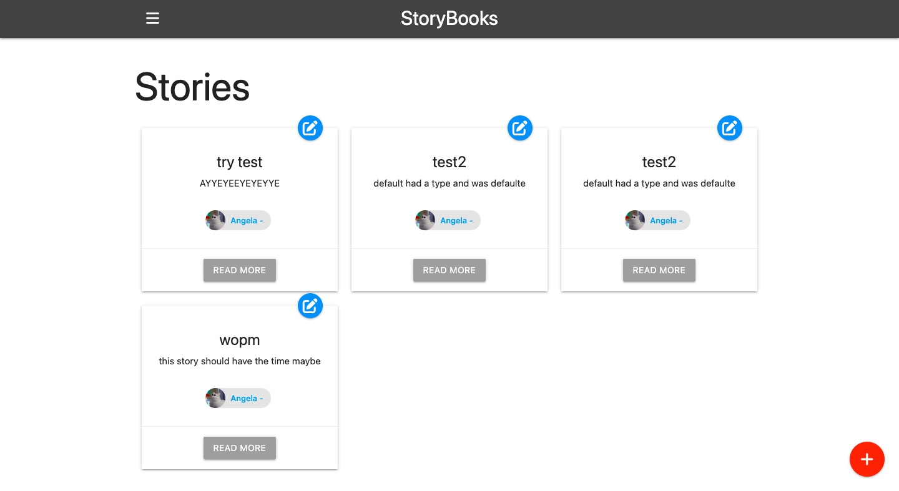

# StoryBooks

This is a repo containing a CRUD app that uses google authenticatoin. Based on one of Traversy's tutorials with some adjustments to make it work with current versions of the dependencies used.

## Tech used

Express, express handlebars, mongoose, passport and google oauth 2.0. Styled with materialize.

## Preview

No live site available womp womp. 

